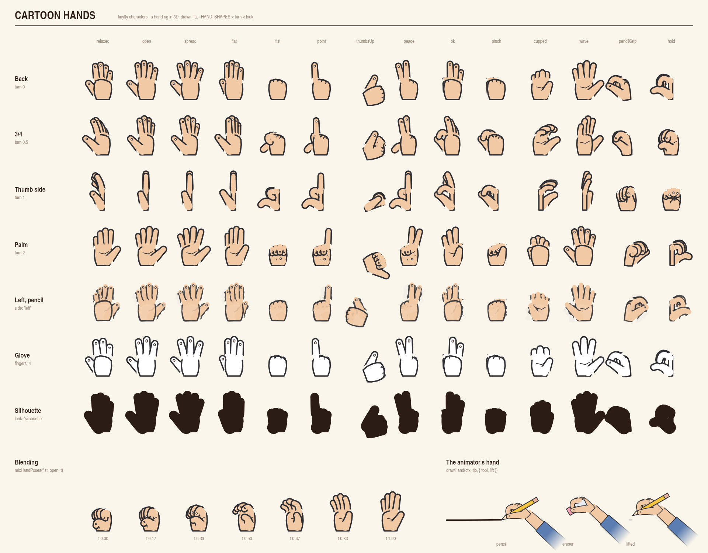

# Cartoon hands

A hand you can pose: a palm and five fingers built in the hand's own 3D space,
posed by a flat record of numbers, turned and drawn flat in any look (clean,
pencil, silhouette). Because the hand is 3D, turning the wrist needs no extra
drawing code: fingers behind the palm are drawn behind it, and nails show only
where they face you.



The sheet is `examples/headless-video/hand-shapes.mjs`.

```js
import { drawCartoonHand, HAND_SHAPES, mixHandPoses } from '@algorisys/tinyfly/characters'

// The wrist at (200, 300), fingers pointing up, 120 px from wrist to fingertip.
drawCartoonHand(ctx, { x: 200, y: 300 }, HAND_SHAPES.point, { size: 120 })

// A left hand in pencil, palm toward us, pointing up and to the right.
drawCartoonHand(ctx, { x: 400, y: 300 }, { ...HAND_SHAPES.wave, turn: 2 }, { side: 'left', look: 'pencil', angle: 30 }, time)

// Halfway from a fist to an open hand.
drawCartoonHand(ctx, at, mixHandPoses(HAND_SHAPES.fist, HAND_SHAPES.open, 0.5))
```

## The pose

Every field is a number, so two poses blend and any field can be a timeline track.

| Field | Meaning |
|---|---|
| `index.curl`, `middle.curl`, `ring.curl`, `pinky.curl` | 0 straight, 1 curled into the palm |
| `thumb.curl` | 0 straight, 1 bent at both knuckles |
| `thumb.across` | 0 out to the side, 1 across the palm |
| `spread` | 0 fingers together, 1 fanned wide |
| `turn` | Wrist turn: 0 back of the hand toward you, 1 thumb side, 2 palm, -1 little-finger side |
| `bend` | Wrist bend, degrees: + toward the palm |
| `tilt` | Wrist tilt, degrees: + toward the little finger |
| `roll` | The whole hand turned in the picture, degrees clockwise (a left hand turns the mirror way) |

`handPose(changes)` gives a full pose from the fields that differ from rest
(`HAND_REST`, a relaxed hand).

### Shapes

`HAND_SHAPES`: `relaxed`, `open`, `spread`, `flat`, `fist`, `point`,
`thumbsUp`, `peace`, `ok`, `pinch`, `cupped`, `wave`, `pencilGrip` (thumb and
middle finger pinch, index on top) and `hold` (every finger wrapped round a
handle). Change single fields on top: `{ ...HAND_SHAPES.point, turn: 2 }`.

## The style

| Option | Meaning |
|---|---|
| `size` | Wrist to the tip of the middle finger, px (default 100) |
| `side` | `'right'` (default) or `'left'`: the left hand is the right mirrored |
| `angle` | Which way the fingers point, degrees clockwise from straight up |
| `fingers` | `5` (default) or `4`: a thumb and three, the classic cartoon glove |
| `plump` | 1 a natural hand (default); 1.5 a fat cartoon glove |
| `skin`, `ink`, `lineWidth` | Fill, outline colour and outline width; a glove is just another skin |
| `look`, `seed`, `pencil` | The look, when no `pen` is given |
| `pen` | Draw with a character's pen, so the hand matches and boils with it |
| `nails` | Nails on fingertips that face you (default true) |
| `prop` | `{ depth, draw(pen) }`: something held, drawn among the fingers at its depth |

## Joints, for props and attachments

`handJoints(pose, style)` returns where everything is with the wrist at (0, 0)
(`handJointsAt` moves it): each finger's joints, depths and widths, the palm
outline, which way the palm faces, and the hand's own axes on screen.
`drawCartoonHand` returns the same, as drawn. Use the fingertips to place a
prop, or the depths to slot it between fingers.

## Where hands are used

- **The animator's hand.** `drawHand(ctx, tip, { tool, lift })` is this hand
  in its `pencilGrip`, holding a pencil or an eraser between the thumb and
  fingers, with a forearm whose sleeve fades out. `handAt(strokes, time)` moves
  one hand through a whole scene: it follows each stroke, lifts and glides to
  the next, and comes in and leaves the page.
- **Characters.** `character({ hands: 'cartoon' })` puts gloved hands on the
  fluid figure (four fingers, plump, `handSize` 0.17 of the height). Each hand
  takes its pose from `hand.left.*` / `hand.right.*` fields in the character's
  pose (`'hand.right.index.curl': 0`), so hands are tracks like everything
  else. `hand.<side>.turn` is relative to how a hand hangs at the side (thumb
  forward); `characterHandPose(pose, side)` shows what a hand will get.

## Not yet

- The editor's Character element still draws round hands; a hand-shape picker
  comes with it.
- A forearm pointing straight at the viewer does not foreshorten the hand.
- The v1 stick figure keeps its round hands.
