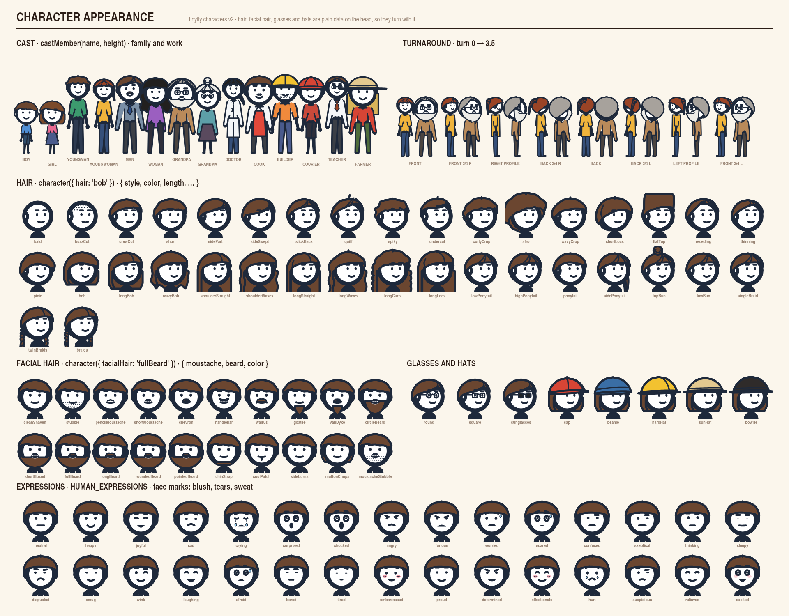

# Character Appearance

Hair, facial hair, glasses, hats, ears, builds, a ready-made cast, held items
and meeting hands for the v2 character (`character()` in `@algorisys/tinyfly/characters`). Every choice
is plain data, so a character can be saved, synced, generated by a language
model and changed one field at a time.



The sheet is drawn by `examples/headless-video/appearance-sheet.mjs`
(`npx tinyfly video examples/headless-video/appearance-sheet.mjs --stills stills/`).

## Quick start

```js
import { character, characterTarget, drawCharacter, humanPose, castMember, HUMAN_EXPRESSIONS } from '@algorisys/tinyfly/characters'

// Pick everything by name…
const maya = character({
  height: 300,
  build: 'slim',
  hair: { style: 'highPonytail', color: '#9a4426' },
  glasses: 'round',
  ears: true,
  outfit: { shirt: '#f0b43c', trousers: '#36507a' },
})

// …or start from the cast and change what you like.
const grandpa = character(castMember('grandpa', 300, { look: 'pencil' }))

// Faces are pose fields, so any expression goes with any action and view.
drawCharacter(ctx, maya, humanPose({ ...HUMAN_EXPRESSIONS.embarrassed, turn: 0.5 }))
```

A plain figure (no `hair`, `facialHair`, `glasses`, `hat` or `ears`) draws
exactly as it did before these options existed.

## How it turns

Hair, beards and hats are not flat drawings pasted on the face. Each is a
region on the head's surface (where the hairline runs, how far the hair stands
off the head, how far it hangs), drawn wherever the head's `turn`, `head.turn`,
`head.nod` and `head.tilt` put it:

- the part facing away is drawn before the body, so long hair hangs behind the
  shoulders seen from the front, and a bob shows beside the face;
- the part facing the viewer is drawn over the head, so a fringe crosses the
  forehead and, from behind, the hair covers the whole head;
- turned away (past about `turn` 1.2), the hair is drawn after the whole body,
  over an arm at the side;
- a parting, a side ponytail or a braid stays on the character's own side
  through a turn: left and right are the character's, never mirrored.

Glasses, moustaches and the face marks sit on the face itself, placed like the
eyes and mouth, so they slide round with the face and hide with it.

**Which part wins where two overlap** is fixed: eyes and brows draw over a
fringe; the mouth draws over a beard, which leaves an opening for it (so every
lip-sync shape stays readable); a moustache draws over the top of the mouth;
glasses over the eyes; a hat over the hair. Ears are hidden by hair that
`coversEars`.

## Views

`turn` runs 0 → 4. The eight reference views:

| View | `turn` |
|---|---|
| Front | 0 |
| Front 3/4 right (nose toward screen right) | 0.5 |
| Right profile | 1 |
| Back 3/4 right | 1.5 |
| Back | 2 |
| Back 3/4 left | 2.5 |
| Left profile | 3 |
| Front 3/4 left | 3.5 |

The view names describe the screen; limb and side names (`arm.left`,
`at: 'left'`) are always the character's own.

## Hair

`hair` takes a style name, a style with changes, or `null`:

```js
character({ hair: 'bob' })
character({ hair: { style: 'bob', color: HAIR_COLORS.auburn, length: 1.4 } })
character({ hair: { volume: 0.2, hairline: { front: 0.3 }, ties: [{ kind: 'bun', at: 'top' }] } })
```

Short cuts and hairlines: `bald`, `buzzCut`, `crewCut`, `short`, `sidePart`,
`sideSwept`, `slickBack`, `quiff`, `spiky`, `undercut`, `curlyCrop`, `afro`,
`wavyCrop`, `shortLocs`, `flatTop`, `receding`, `thinning`.

Medium and long hair: `pixie`, `bob`, `longBob`, `wavyBob`, `shoulderStraight`,
`shoulderWaves`, `longStraight`, `longWaves`, `longCurls`, `longLocs`,
`lowPonytail`, `highPonytail`, `ponytail`, `sidePonytail`, `topBun`, `lowBun`,
`singleBraid`, `twinBraids`, `braids`.

Every style is the same few fields (`resolveHair(spec)` fills them all in):

| Field | Meaning |
|---|---|
| `color` | Fill colour. `HAIR_COLORS` has `black`, `brown`, `chestnut`, `auburn`, `blond`, `ginger`, `gray`, `white` |
| `volume` | How far the hair stands off the head (head radii) |
| `hairline` | `{ front, side, back }`: its height at the forehead, temples and nape (head radii, +up from the head's centre) |
| `sweep` | A side fringe: the hairline drops toward the character's left (+) or right (−) |
| `recede` | Temples pushed back |
| `length` | Long hair: where it ends, head radii below the head's centre (`0` short; about 1.75 is the shoulders) |
| `opening` | Long hair: half the opening left for the face, degrees |
| `texture`, `textureAmount` | `smooth`, `spiky`, `curly`, `wavy` or `locs`, and how strong |
| `quiff`, `flat` | Volume swept up over the forehead; a flat top's height |
| `part`, `strands` | A parting (degrees round from the middle of the face) and the detail lines: `none`, `part`, `sweep`, `combed`, `hanging`, `thin` |
| `fill` | `solid`, or `stipple` (close-cropped: dots on the scalp) |
| `ties` | Ponytails, buns and braids: `{ kind: 'ponytail' \| 'bun' \| 'braid', at: 'top' \| 'high' \| 'low' \| 'left' \| 'right', length?, size? }` |
| `coversEars` | The hair hides the ears |

A style stays a starting point: any style suits anyone.

## Facial hair

`facialHair` takes a style name or `{ moustache, beard, color }` (the colour
defaults to the hair's):

`cleanShaven`, `stubble`, `pencilMoustache`, `shortMoustache`, `chevron`,
`handlebar`, `walrus`, `goatee`, `vanDyke`, `circleBeard`, `shortBoxed`,
`fullBeard`, `longBeard`, `roundedBeard`, `pointedBeard`, `chinStrap`,
`soulPatch`, `sideburns`, `muttonChops`, `moustacheStubble`.

Moustaches: `none`, `pencil`, `short`, `chevron`, `handlebar`, `walrus`.
Beards: `none`, `stubble`, `goatee`, `soulPatch`, `chinStrap`, `circle`,
`boxed`, `full`, `rounded`, `pointed`, `long`, `sideburns`, `muttonChops`.

## Glasses, hats and ears

- `glasses`: `round`, `square`, `sunglasses` (drawn in the ink; the near arm
  runs back to the ear in profile).
- `hat`: `cap`, `beanie`, `hardHat`, `sunHat`, `bowler`, or `{ style, color }`.
  The crown sits over the hair; hair below the brim still shows.
- `ears: true` adds ears: they stick out past the head from the front and
  behind, and sit on the head with a curl when turned toward the viewer.

## Builds

`build` sets proportions; `height` sets how tall the character stands. Any
field can still be set on its own (`headSize`, `shoulderWidth`, `hipWidth`,
`legLength`, `armLength`).

| Build | What changes |
|---|---|
| `standard` | Nothing |
| `slim` | Smaller head, narrower |
| `tall` | Smaller head, longer legs and arms |
| `short` | Larger head, shorter legs, a little wider |
| `broad`, `curvy`, `stocky` | Shoulder and hip widths (stocky: a larger head) |
| `kid`, `child`, `toddler` | Larger head, shorter limbs |

Age, posture and accessories are separate choices: a child build is only
proportions, and an older character is shown by hair and glasses, never by a
stoop unless one is posed. The same poses, gaits and actions work on every
build; `humanGaitStrideLength(gait, height, stride, legLength)` gives a build's
stride so its feet stay planted.

## Clothes

`outfit` dresses the character as data (any `layers` are drawn over it):

```js
character({ outfit: { shirt: '#7a8fa6', trousers: '#3b3f46', sleeves: 'long', collar: true, tie: '#2b4f8c' } })
character({ outfit: { bottom: 'skirt' } })
character({ outfit: { over: 'labCoat' } })
```

| Field | Choices |
|---|---|
| `shirt`, `trousers` | Colours (the trousers' colour also colours shorts and a skirt) |
| `sleeves` | `short` (default), `long`, `none` |
| `bottom` | `trousers` (default), `shorts`, `skirt` |
| `collar` | `true` for a shirt collar |
| `tie` | A colour, for a tie down the front |
| `over`, `overColor` | `apron` or `labCoat`, and its colour |

The front details (collar, tie, apron, the coat's opening) show from the
front and turn away with the body; from behind an apron shows its ties.
`basicOutfit(options)` gives the same clothes as layers.

## The cast

`castMember(name, height, changes?)` returns character options for a recurring
cast member at an adult `height` (each stands at their own scale of it). The
family: `boy`, `girl`, `youngMan`, `youngWoman`, `man`, `woman`, `grandpa`,
`grandma`; at work (from the occupations sheet): `doctor`, `cook`, `builder`,
`courier`, `teacher`, `farmer`. `CHARACTER_CAST` has each one's `label`,
`group` (`family` or `work`), `scale` and `options`.

```js
const family = ['man', 'woman', 'girl', 'grandma'].map((name) => character(castMember(name, 280)))
```

## Expressions and face marks

`HUMAN_EXPRESSIONS` sets every face field, so applying one replaces the whole
face, and any two blend. Besides the stick figure's faces (`neutral`, `happy`,
`joyful`, `sad`, `crying`, `surprised`, `shocked`, `angry`, `furious`,
`worried`, `scared`, `confused`, `skeptical`, `thinking`, `sleepy`,
`disgusted`, `smug`, `wink`) there are `laughing`, `afraid`, `bored`, `tired`,
`embarrassed`, `proud`, `determined`, `affectionate`, `hurt`, `suspicious`,
`relieved` and `excited`.

Three face marks fade in from 0 to 1 and are pose fields like any other (so
tracks animate them): `blush` (rosy cheeks, with hatch lines past 0.5),
`tears` (a drop under each eye, running down past 0.6) and `sweat` (a bead at
the temple).

## Everyday actions, held items and meeting hands

The motion and everyday-life sheets add poses to `HUMAN_POSES`: `sleep`,
`stretch`, `sitFloor` (cross-legged), `carry`, `lift`, `push`, `pull`,
`drink`, `phone`, `read` and `type` (seated, for a desk). Like every pose they
blend, turn and take any face.

**Holding things.** `holding` puts an item in a hand, as data:

```js
character({ holding: { right: 'mug' } })                 // drink
character({ holding: { left: 'bag', right: 'bag' } })    // carry
character({ holding: { both: { item: 'parcel', color: '#c9a06a' } } })
```

Items: `mug`, `phone`, `briefcase`, `bag`, `umbrella` and `broom` (one hand,
`left` or `right`), `book` (one hand or `both`) and `parcel` (`both`). Each is
drawn at the hand's grip, so it follows the hand through any pose, gait or
turn, and sorts with that arm (a mug goes behind the body with the far arm).
An umbrella's canopy sits just over the head. `handGrip(joints, side)` gives
the grip point and the forearm's direction for drawing anything else in a
hand.

Whether an item shows is a pose field, `held.left`, `held.right` or
`held.both` (1 by default; below 0.5 it has been let go), so a track lets go
of it at a moment: a parcel handed over is the giver's `held.both` going to 0
as the taker's goes to 1.

**Meeting hands.** `meetHands(kind, a, b, options?)` poses two characters so
their hands meet at one point, rather than playing two clips and hoping they
line up: `handshake`, `highFive`, `fistBump` and `handOver` (four hands round
one parcel). Each partner is `{ character, x, pose? }` on the same ground
line; the one on the left turns to face right and the other left,
three-quarters on (`view: 'side'` for profiles). Stand them
`meetingSpacing(kind, a, b)` apart; the result's `reached` says whether both
got there.

```js
const gap = meetingSpacing('handOver', courier, neighbour)
const give = meetHands('handOver', { character: courier, x: 300 }, { character: neighbour, x: 300 + gap })
// give.a and give.b are poses to key; give.point is where the parcel is.
```

## In the editor

Select a 🧍 Character and open **Head** in the properties: **Cast** dresses it
as a cast member (build, hair, facial hair, glasses and clothes in one step),
then **Hair**, **Hair colour**, **Facial hair**, **Glasses**, **Hat** and
**Ears** change one thing at a time; **Right hand**, **Left hand** and **Both
hands** put an item in them. **Build** lists the builds, with **Legs** and
**Arms** sliders. The new expressions and everyday poses are in the **Face**
and **Body** lists. All of it is saved as plain fields on the element and
exported to video and GIF.

## In the gallery

- **Cast Turnaround**: the whole cast turning through all eight views together.
- **Hair, Beards & Hats**: pick a style, colour, facial hair, glasses, hat and
  face, and see the character turning and in all eight views at once.
- **Hand Over**: a courier walks up and hands a parcel over (`meetHands`,
  `holding`, `held.both`).

## Determinism

Outlines are traced from the same numbers every time (no randomness, no state
between frames), so a frame at a given time always draws the same, and the
pencil look's boil stays seeded as before.
