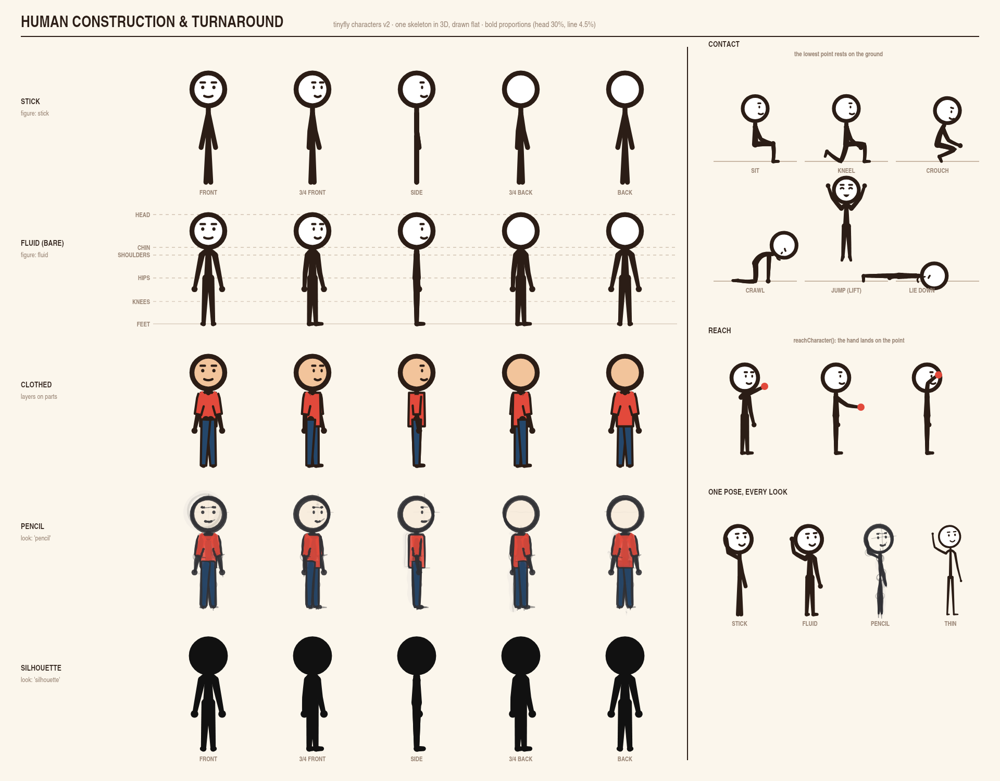

# Character System — Milestone 1: rig core (design)

**Status:** Built on `feat/character-v2`, for review (core and the editor's character element)



## Built so far

| Piece | Where |
|---|---|
| Body plans, chains, bone angles | `src/characters/rig/body-plan.ts` |
| Skeleton: 3D bones, turn, roll, contact, lift | `src/characters/rig/skeleton.ts` |
| Reaching (two-bone, exact) | `src/characters/rig/reach.ts` |
| The human plan, rest pose, 10 named poses | `src/characters/species/human.ts` |
| Pen: clean, pencil (boil, pressure, construction lines, rubbed-out attempts), silhouette | `src/characters/look/pen.ts` |
| Face on the head, sliding round with the turn | `src/characters/head/face.ts` |
| `character()`, `drawCharacter()`, `characterJoints()`, `characterTarget()`, `characterAt()`, `reachCharacter()`, `mixPoses()` | `src/characters/character.ts` |
| Tests (joints vs drawing, turn invariants, depth order, contact, reach, determinism, looks) | `src/characters/character.test.ts` |
| Model sheet | `examples/headless-video/human-turnaround.mjs` → `docs/model-sheet/human-turnaround.png` |

`taperedLine` and `rubberLimb` moved to `src/characters/look/` (re-exported
from the v1 module unchanged) so v2 does not depend on v1. v1's tests and
golden frames pass unchanged.

### The editor's character element

| Piece | Where |
|---|---|
| `character` element type (figure, look, colours, outfit, pose) | `src/editor/stores/scene-store.ts` |
| Element → character, pose at a time, canvas target, DOM canvas | `src/editor/utils/character-element.ts` |
| 🧍 Character in the Elements panel (centred, sized to the canvas) | `src/editor/components/element-panel.tsx` |
| DOM preview canvas, repainted with the animated pose | `src/editor/components/preview-panel.tsx` |
| Canvas preview and GIF / MP4 export | `src/editor/utils/scene-to-canvas.ts` |
| Character section: figure, look, colours, clothes, view, body, face, ◆ keyframe | `src/editor/components/property-panel.tsx` |
| Key a pose at the playhead in one undo step | `keyValuesAtPlayhead` in `src/editor/stores/editor-store.ts` |
| Plain-language track names | `trackPropertyLabel` (timeline, track list, curves) |

The library gained `characterPoseTracks()` (timed poses to tracks),
`humanFieldLabel()`, `HUMAN_EXPRESSIONS` and `basicOutfit()` (a T-shirt and
trousers whose sleeves grow out of the shoulders), and the whole-figure roll
field is `roll` (not `rotate`, which turns an element's box).

Not yet: characters in exported HTML / embeds and in the SVG preview.

### Not done yet in milestone 1

- **Faces in profile** use a cartoon mapping (the face shifts toward the side
  it faces) rather than the true sphere, so a profile keeps an eye and a mouth;
  noses and profile mouths come with milestone 3.
- **Reaching** is exact for two-bone limbs; long chains come with the animals.
**Plan:** [character-system-plan.md](character-system-plan.md)

Milestone 1 builds the skeleton every later character uses, and a human on it,
drawn in three looks (clean, pencil, silhouette) and two figure styles (stick,
fluid). It ends with a turnaround model sheet.

---

## Space and turning

A character is built in its own 3D space, measured from the ground under its
hips:

- **+x** is the character's **left**, **+y** is up, **+z** is the way it faces.
- `turn` spins it about the vertical axis by `turn × 90°`: **0** faces the
  viewer, **1** faces screen-right (profile), **2** shows its back, **3** faces
  screen-left. Any value works (0.5 is a 3/4 view; -1 is the same as 3).
- The view is orthographic: screen x = x·cos θ + z·sin θ, screen y = −y, and
  **depth** (toward the viewer) = −x·sin θ + z·cos θ.

With +x as the character's left, its left arm is on screen-right in the front
view (as a real person facing you) and is the far arm when it faces right.

## Body plans, chains and bones

```ts
interface BoneSpec { length: number; width: [number, number] }   // fractions of height
interface ChainSpec {
  id: string                      // 'spine', 'neck', 'arm.left', 'leg.right'
  parent: string | null           // chain it hangs from (null: the hips)
  at?: number                     // parent joint index (default: its end)
  offset?: [number, number, number] // from that joint, fractions of height
  rest: [number, number, number]  // direction of the first bone at rest
  bones: BoneSpec[]
  side?: -1 | 1                   // right (-1) or left (+1): sets which way "spread" goes
}
interface BodyPlan { id: string; chains: ChainSpec[]; head: HeadSpec; contacts: ContactSpec[] }
```

### Bone angles

Each bone's direction comes from its chain's rest direction, turned by two
angles in degrees:

- **swing**: forward (+) and back (−), about the character's x axis;
- **spread**: away from the body (+) and across it (−), about its z axis.

A bone's angles add to its parent bone's, as v1's elbow adds to its shoulder.
Direction = Rz(spread · side) · Rx(swing) · rest. Seen from the front only the
spread shows; seen from the side only the swing. This is what fixes the
"arms forward and back in profile" problem.

## Pose

A pose is a flat record of numbers, so poses blend and every field can be a
timeline track. The human's fields:

| Field | Meaning |
|---|---|
| `turn` | View, as above |
| `lean`, `side` | Upper body: forward/back and sideways bend, degrees |
| `head.turn`, `head.nod`, `head.tilt` | Head yaw on the body, pitch, roll |
| `arm.left.swing`, `arm.left.spread`, `arm.left.elbow` | Upper arm, and the elbow (forearm swings forward) |
| `leg.left.swing`, `leg.left.spread`, `leg.left.knee` | Thigh, and the knee (shin swings back) |
| `leg.left.ankle`, `leg.left.toeOut` | Foot tilt (toes up +), and the foot turned out (+) or in (−) from its natural angle |
| `leg.left.rotate` | The whole leg turned out at the hip, degrees: at 90 a bent knee points sideways (a turned-out plié) |
| `stretch` | Squash and stretch, as v1 |
| `lift` | Height above the surface, fraction of height (a jump) |
| `roll` | Whole-figure roll in the picture plane, degrees (falling, lying). Not `rotate`, which turns an element's box |
| `mouth`, `smile`, `mouthWidth`, `blink`, `eye.left`, `eye.right`, `brow.left`, `brow.right`, `browTilt`, `lookX`, `lookY` | Face, as v1 |

(`.right` fields as `.left`.)

## Placing on a surface

After the pose is projected and rolled by `roll` (about the hips), the
lowest **contact point** rests on the ground (y = 0): toes and heels, knees,
hands, elbows, hips, the head. Lying down, kneeling and crawling are then just
poses. `lift` raises the figure above that. `contact: 'none'` turns placement
off (a figure in the air keeps its hips at standing height).

## Reaching

`reachPose(character, pose, 'arm.left', target)` returns the pose with that
limb's angles solved so its end touches `target` (a point in character space,
or a screen point given a depth). Two-bone limbs are solved exactly, bending
the elbow down and back and the knee forward; out of reach, the limb points
straight at the target. Long chains (tails, trunks) come with the animals.

## Drawing

1. Solve the bones (forward kinematics), project, roll, place.
2. Build **parts**: each chain is one part with a depth (its average); the head
   is a part. Sort far to near; ties keep the plan's order (legs, torso, arms,
   head), so arms in front of the chest stay in front.
3. Draw each part with the figure style and the pen, calling layer hooks:
   `layers: { [partId]: { under?, over? } }`, plus `behind` and `front` for
   the whole figure. A sleeve on the far arm is behind the body because the
   arm is.

### Figure styles

- **`stick`**: the traditional (Pencilmation) stick figure: even lines, a
  circle head, one point for the shoulders and hips, no hands or feet.
- **`fluid`**: tapered limbs, small hands, feet, rounded shoulders. Clothes
  and hair are layers on top (wardrobe is milestone 4).

### Looks: the Pen

```ts
interface Pen {
  readonly look: 'clean' | 'pencil' | 'silhouette'
  limb(points: Point[], from: number, to: number): void  // tapered stroke
  line(points: Point[], width?: number): void           // even stroke
  shape(points: Point[], fill: string): void            // closed, filled, outlined
  ellipse(cx: number, cy: number, rx: number, ry: number, angle: number, fill?: string): void
  dot(x: number, y: number, r: number): void
}
```

Every part, and every layer hook, draws through the pen it is handed:

- **clean**: filled tapered shapes and canvas strokes.
- **pencil**: graphite strokes in passes that boil (the existing `sketchPen`
  wobble), **pressure variation** along each stroke (seeded, so a stroke is the
  same every frame of its boil), **construction lines** (the skeleton's guide
  shapes, faint, under the final line: the head circle with its centre lines, a
  torso line, joint circles), and **rubbed-out lines** (a few earlier attempts,
  faint and smudged, offset from the final line). All seeded by the
  character's seed, the boil frame and the stroke's order.
- **silhouette**: everything filled in the ink colour, for the readability
  check.

### Head

The head is an ellipsoid (a sphere stretched by `stretch`). Face features
(eyes, brows, mouth) have a position on its surface, an angle around from the
front and an angle up. They are drawn where the head's yaw (`turn` plus
`head.turn`) puts them, narrowed as they turn away, and hidden on the far side,
so the face slides round in 3/4, shows one eye in profile and disappears at the
back. Eye, brow and nose styles, ears and lip-sync shapes are milestone 3.

## Public API (milestone 1)

```ts
const hero = character({ figure: 'fluid', look: 'clean', height: 400, ink: '#2b1d16', skin: '#f2c49b', layers })
drawCharacter(ctx, hero, pose, time)          // feet at (0, 0)
characterJoints(hero, pose)                    // every point, part and depth, as drawn
characterTarget({ x, y, character: hero, pose })  // a canvas custom target; pose fields are props
characterAt(target, frame, id)                 // its joints in a frame, for draw()
humanPose(changes)                             // a full pose from the fields that differ from rest
mixPoses(a, b, t)                              // blend
reachPose(hero, pose, chain, target)           // IK
```

Defaults are the bold look: head 30% of the height, line 4.5% of the height.
`proportions: 'thin'` gives the reference sheets' lighter line and 24% head.

## Tests

- Joints match drawing (recorded canvas calls vs `characterJoints`).
- Turn invariants: `turn` 2 is `turn` 0 mirrored with the face hidden; `turn`
  1 and 3 mirror each other; arms spread sideways vanish edge-on in profile.
- Contact: the lowest contact point is at y = 0 for every pose.
- Reach: within 0.5 px when in reach.
- Determinism: the pencil look draws identically twice for the same time, and
  changes between boil frames.
- v1's golden frames and tests are untouched.
