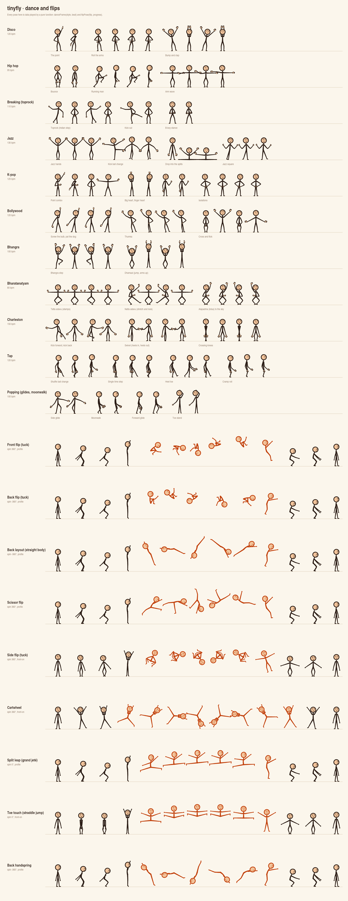

# Dance and Flips

The stick figure from `@algorisys/tinyfly/characters` can dance (disco, hip
hop, breaking toprock, jazz, K-pop, Bollywood, Bhangra, Bharatanatyam,
Charleston, tap, popping with its glides and the moonwalk) and do
flips (front, back, layout, scissor, side flip, cartwheel, back handspring),
leaps (split leap, toe touch) and full splits.
Like everything else in tinyfly, it is plain data played by pure functions:
the same style at the same beat always gives the same pose, so a dance scrubs,
renders to video and syncs to music exactly.

Try it on the Examples page: **Dance Floor (Characters)**.



The sheet is `examples/headless-video/dance-sheet.mjs`.

```js
import { danceFrame, drawStickFigure } from '@algorisys/tinyfly/characters'

// Beats, not milliseconds: any tempo plays the same dance.
const beat = (time * 120) / 60000
const { pose, hands } = danceFrame('disco', beat)
drawStickFigure(ctx, pose, { height: 220, hands: { ...hands } })
```

## The joints that make it dance

Dancing needs more than shoulders, elbows, hips and knees. These pose fields
are numbers like every other, so they blend and can be timeline tracks:

| Field | Meaning |
|---|---|
| `leftWrist`, `rightWrist` | Wrist bend, degrees, added to the forearm like the elbow is to the upper arm. Turns `handAngle`, `fingertips` and the drawn hands |
| `leftAnkle`, `rightAnkle` | Positive points the toe down (onto tiptoe, which lifts the body); negative flexes it up onto the heel |
| `leftFootOut`, `rightFootOut` | Feet turned out (positive, 1 fully sideways) or in (negative) from their natural splay: Bharatanatyam's turn-out, a twist |
| `spin` | The whole body turned about the hips, degrees: positive rolls forward (a front flip), negative backward. Front-on (`turn` 0) it is a cartwheel |
| `rise` | Lift off the ground, as a fraction of the height. Once off the ground, the feet stop being planted, so a tuck keeps the hips' height |

The joints gain `fingertips` (where each hand reaches), and `handAngle` now
includes the wrist. All of these default to 0, which draws exactly as before.

### Hands with fingers

`style.hands` replaces the dot hands with [cartoon hands](cartoon-hands.md),
posed per side and turned by the wrist:

```js
drawStickFigure(ctx, pose, {
  hands: { left: HAND_SHAPES.fist, right: HAND_SHAPES.point, size: 0.1 },
})
```

Dance keys set hand shapes by name: any of `HAND_SHAPES` (`point`, `fist`,
`spread`, `peace`, `cupped`…) or the `MUDRAS` of Indian classical dance:
`pataka`, `tripataka`, `alapadma`, `mushti`, `shikhara`, `hamsasya`,
`katakamukha`.

## Moves, styles and routines

A **move** is a short loop of keys counted in beats. Each key changes some
joints from the previous key (`reset: true` starts again from the stance), may
set hand shapes, and names the easing into it:

```js
const point = {
  label: 'The point',
  beats: 2,
  easing: 'ease-out-cubic',
  keys: [
    { beat: 0, pose: { rightShoulder: 150, leftShoulder: 40, leftElbow: -105, lean: -5 }, hands: { right: 'point', left: 'fist' } },
    { beat: 1, pose: { rightShoulder: -30, lean: 5 } },
  ],
}
```

A **style** gathers a stance (the base every move builds on), a face, a
**groove** (a knee bounce on or off the beat and a sway over two beats, which
every move carries), its moves, and a **routine** that strings them together.
Steps can be mirrored (left and right swap), and one step blends into the next
over half a beat.

```js
const twoStep = {
  label: 'Two-step',
  bpm: 100,
  stance: { leftHip: 12, rightHip: 12 },
  expression: 'happy',
  groove: { bounce: 10, accent: 'down', sway: 3 },
  moves: { point },
  routine: [
    { move: 'point', beats: 8 },
    { move: 'point', beats: 8, mirror: true },
  ],
}
```

`DANCE_STYLES` has eleven ready-made styles. Each is plain data, so copy one and
change it:

| Style | Moves |
|---|---|
| `disco` | the point, rolling arms, bump and clap |
| `hipHop` | bounce (down on the beat), running man (side-on), arm wave |
| `breaking` | toprock (Indian step), kick out, b-boy stance |
| `jazz` | jazz hands, kick ball change (pointed toe), jazz square, drop into the splits |
| `kpop` | point combo, big heart and finger heart, isolations (sharp hits) |
| `bollywood` | thumka, screw the bulb and pat the dog, cross and flick |
| `bhangra` | the bhangra step (knee lifts, arms up), dhamaal jumps |
| `bharatanatyam` | tatta adavu (stamps in aramandi), natta adavu, alapadma to the sky |
| `charleston` | kick forward and back, swivel (heels in, heels out with `footOut`), crossing knees |
| `tap` | side-on: shuffle ball change, single time step (stamp, shuffle, hop, step, flap, step), heel toe, cramp roll; every strike is in `taps` |
| `popping` | side glide (front-on), moonwalk and forward glide (side-on), toe stand; the glides travel (see below) |

### Travelling moves: glides and the moonwalk

Most moves dance on the spot. A move with `travel` carries the figure across
the floor at a steady speed: `travel` is the ground one loop covers, as a
fraction of the figure's height, positive toward +x (the way a side-on figure
faces). The moonwalk's is negative, so it slides backward while its feet look
like they step forward. A mirrored step travels the other way front-on (left
and right swap) and keeps its direction side-on (the figure still faces the
same way).

Popping's glides follow one rule. On each beat one foot is planted on its toe
and drops its heel while the other slides flat along the floor; then they
swap. Their keys are linear and their `travel` matches the planted foot, so
that foot stays put on the floor while the body glides over it. The tests
check this with `stickFigureJoints()`. The popping routine glides right, back
left, moonwalks away and glides forward home, so it loops on the spot.

```js
import { danceFrame, danceTravel, danceTravelTrack, drawStickFigure } from '@algorisys/tinyfly/characters'

const { pose } = danceFrame('popping', beat, { move: 'moonwalk' })
const x = startX + danceTravel('popping', beat, { move: 'moonwalk' }) * 220 // heights → px
drawStickFigure(ctx, pose, { height: 220 })

// On a timeline: an x track with linear keys where the speed changes.
const xTrack = danceTravelTrack('tum', 'popping', { bpm: 100, height: 220, x: 340 })
```

`bakeDanceTracks()` and the editor's **🕺 Dance from playhead** add that `x`
track themselves when given the figure's height (the editor uses the
character's, from where it is at the playhead). With `danceTracks()` add
`danceTravelTrack()` beside the two tracks. It eases in and out over the same
`fade` (default 1 beat), so the figure does not glide before it has danced in.
Pass `fade: 0` for full speed from the first beat to the last. A routine that does not come back
keeps going the same way each time it loops. The Dance Floor carries its
dancer off one side of the stage and brings it back in at the other.

### Dancing to music

Beats are the tempo's: `beatAt(time, bpm, start)` turns time into beats, so
`danceFrame(style, beatAt(time, music.bpm, music.firstBeat))` keeps a dancer
on the music. To find a song's tempo and its first beat, use the engine's
`detectTempo(samples, sampleRate)` (see the API reference); in the editor, an
Audio element's **🎵 Detect tempo** does it, and a Character's dances then
follow the beat.

### Taps: when the feet strike the floor

A key can name the parts of the feet that strike the floor on it:
`taps: ['rightToe']`, `['leftHeel']`, or both of a foot for a stamp. Tap is
built on them, and Bharatanatyam's stamps carry them too. `danceTaps(style,
from, to)` lists the strikes between two beats (the end not included), in
order, through the routine and its mirrored steps, so calling it each frame
with the last frame's beat and this one's gives exactly the taps that just
happened: play a sound, flash the foot, shake the floor.

```js
for (const { beat, tap } of danceTaps('tap', lastBeat, beat)) {
  playClick(tap.endsWith('Heel') ? 'heel' : 'toe')
}
```

The Dance Floor example flashes the foot at `joints.toes[side]` and, with
"tap sounds" on, clicks through Web Audio.

### The functions

```ts
danceFrame(style, beat, { move?, mirror? }): { pose, hands }  // the routine, or one move on a loop
stickToHuman(pose): CharacterPose                             // a stick pose on a v2 character
danceTaps(style, fromBeat, toBeat, options?): { beat, tap }[]  // foot strikes, for sounds
danceTravel(style, beat, options?): number                    // ground covered, in heights
danceTravelTrack(target, style, { height, x?, bpm?, beats?, start?, fade?, move?, mirror? }): Track | undefined
mirrorHumanPose(pose): CharacterPose                            // a v2 pose's mirror image
dancePose(style, beat, options?): StickPose
routineBeats(style): number
beatAt(timeMs, bpm, startMs = 0): number
mirrorPose(pose): StickPose
applyGroove(pose, groove, beat): StickPose
danceStance(style): StickPose
```

### On a timeline

Give a stick-figure target a dancer, then two small tracks make it dance:
`beat` counts beats at the tempo, and `dancing` blends it in from standing and
back out.

```js
import { stickFigureTarget, dancer, danceTracks } from '@algorisys/tinyfly/characters'

const tum = stickFigureTarget({ x: 340, y: 300, dance: dancer('bollywood'), style: { hands: {} } })
const tracks = danceTracks('tum', { bpm: 120, beats: 32, start: 1000 })
```

For a timeline that must stand alone as JSON (no `dance` option), bake the
dance into pose keyframes, a few per beat:

```js
bakeDanceTracks('tum', 'kpop', { bpm: 125, beats: 16, samplesPerBeat: 4 })
```

Hand shapes bake too, as `hand.left.*` / `hand.right.*` tracks (one per hand
pose field that moves, such as `hand.right.index.curl`). A target drawn with
`style.hands` has a prop for every hand field, so those tracks pose its
fingers; pass `hands: false` to leave them out.

### On a v2 character, and in the editor

`stickToHuman(pose)` turns a stick-figure pose into a v2 character pose, so
every dance and flip plays on `character()` figures too. Each stick limb angle
is split by the view into a sideways `spread` and a forward `swing`, and the
character turns the same way. Front-on, a stick leg lies in the picture: on
the character that is a leg turned out 90° at the hip (`leg.*.rotate`), so
knees bend out over the toes as they do on the stick figure (Bharatanatyam's
half-sit, a plié). Foot turn-out becomes `leg.*.toeOut`, and `rise` and `spin`
become `lift` and `roll`. Pass the frame's hands too, `stickToHuman(frame.pose,
frame.hands)`, and it adds the `hand.left.*` / `hand.right.*` fields a
character with `hands: 'cartoon'` draws: the shapes and mudras, with the wrist
bends as each hand's `roll`. `handStyle: 'natural'` gives five-fingered hands,
so mudras read finger by finger.

```js
import { character, drawCharacter, danceFrame, stickToHuman } from '@algorisys/tinyfly/characters'

const frame = danceFrame('bharatanatyam', beat)
drawCharacter(ctx, character({ figure: 'fluid', hands: 'cartoon', handStyle: 'natural' }), stickToHuman(frame.pose, frame.hands), time)
```

In the editor, a **🧍 Character** has a **Dance** section: pick a style, a
move (or the whole routine) and a tempo, then **🕺 Dance from playhead**. Or
pick a flip and **🤸 Flip at playhead**. Both write ordinary keyframes, a few
a beat, and keep the character's keys before and after. Glides and the
moonwalk also write an `x` track from where the character stands. A character
facing left (the *Side (left)* view) dances the mirror image (`mirrorHumanPose()`:
sides swap, it turns, tips and rolls the other way) and glides the other way;
it turns between 3 (side-on, facing left) and 4 (front-on), never round the
back. With **Hands:
Cartoon gloves** or **Natural**, dances key the hand shapes and mudras too. Flips travel from where
the character is, the way it faces: pick the *Side* or *Side (left)* view
first.

### Side-on moves

Moves can be danced side-on (tap, the running man). Side-on, a limb's angle
swings it forward or back, and forward is a positive angle for the right limbs
and a negative one for the left. The groove follows: both knees bend forward.
Mirroring a side-on pose gives the move to the other arm and leg while the
figure keeps facing the same way; front-on it is a mirror image.

## Flips

A flip is one continuous motion: wind up (crouch, arms back), take off (arms
swing up, toes push), the air, and land (absorb in a crouch, stand).
`progress` runs 0 → 1 through all of it. The body's pose is keyed; the turn
and the height are not. In the air the hips follow a parabola, and the turn
starts at take-off and is quickest at the top, where a tuck spins fastest.
After landing the turn is a whole number of turns, drawn as none, so the
figure blends on into any other pose.

```js
import { flipPose, flipTravel, flipTracks, FLIPS } from '@algorisys/tinyfly/characters'

const figure = flipPose('backFlip', 0.5)          // upside down, at the top
const x = startX + flipTravel('backFlip', 0.5, 220)  // ground covered so far, px

// As keyframe tracks (every moving joint, spin, rise, and x when given a height):
const tracks = flipTracks('tum', 'frontFlip', { start: 2000, height: 220 })
```

| Flip | Seen | Notes |
|---|---|---|
| `frontFlip` | profile | tuck, rolls forward |
| `backFlip` | profile | tuck, rolls backward |
| `layout` | profile | back flip with a straight, arched body |
| `scissorFlip` | profile | legs scissor through the turn |
| `sideFlip` | front-on | tucked side flip |
| `cartwheel` | front-on | arms overhead reach the ground half way round |
| `backHandspring` | profile | arms reach back to the ground, legs snap over |
| `splitLeap` | profile | grand jeté: a front split in the air, no turn |
| `toeTouch` | front-on | straddle jump, hands reaching for the toes |

Each `Flip` is data (`view`, `spin`, `height`, `travel`, `takeoff`, `landing`,
`duration`, `keys`), so new ones are a copy and a few numbers. To flip in the
middle of a dance, blend from the dance pose to `flipPose()` over the first and
last tenth of the flip, as the Dance Floor example does.

## Full splits

`POSES.sideSplit` (front-on, legs straight out to each side) and
`POSES.frontSplit` (in profile, one leg forward, one back) put the legs flat
along the floor; the planted feet bring the hips right down to it, so a split
is just a pose to blend into. Jazz's `splitDrop` move slides down into one,
holds, and gathers back up through a crouch.

## Limits

The stick figure is drawn in one plane, front-on or in profile. Floor work
(windmills, headspins, freezes on the hands) and body rolls need a bendable
spine and limbs that reach a point; those come with
[Characters v2](character-system-plan.md).
