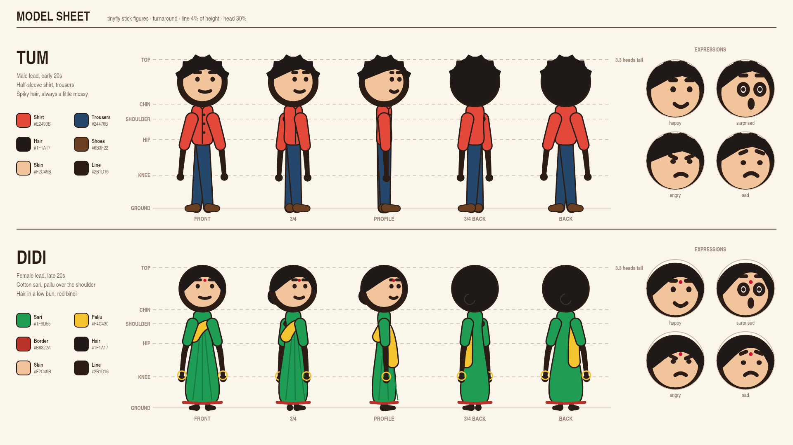

# Model sheet

A reference sheet for the stick-figure characters: how they are proportioned,
dressed and coloured, and how they look from every side. Use it to keep a cast
consistent across scenes and videos.



| | Tum | Didi |
|---|---|---|
| Role | Male lead, early 20s | Female lead, late 20s |
| Height | 360 px (3.3 heads) | 340 px (3.3 heads) |
| Clothes | Half-sleeve shirt, trousers, shoes | Cotton sari, pallu over the shoulder, bangles |
| Hair | Spiky, a little messy | Parted, low bun, red bindi |

Both use the bold look: line width 4% of the height (`lineWidth: height * 0.04`),
head 30% of the height (`headSize: 0.3`), `shoulderWidth: 0.07`, `rubber: 0.3`.

## The views

Each view is the same pose with a different `turn` and `facing`:

| View | `turn` | `facing` |
|---|---|---|
| Front | 0 | 1 |
| 3/4 | 0.5 | 1 |
| Profile | 1 | 1 |
| 3/4 back | 0.5 | -1 |
| Back | 0 | 1 |

The pose's arm and leg spread closes up as the figure turns: limb angles spread
sideways, and seen from the side a sideways spread would read as one arm
forward and one back. In the turned views the far arm sits behind the body (the
rig draws it before the torso once `turn` passes 0.25), and from the front the
feet turn out.

The figure has no back view of its own, since its face always shows. The
costume draws one: in the back views the `overHead` layer covers the whole head
with hair, and the clothes skip the front details (buttons, pleats) and hang the
pallu down the back.

## Regenerate

The sheet is drawn by code in
[`examples/headless-video/model-sheet.mjs`](../../examples/headless-video/model-sheet.mjs),
which also holds the costume, hair and palette code to copy into a scene:

```bash
npm run build:libs
npx tinyfly video examples/headless-video/model-sheet.mjs --stills stills/
cp stills/0-middle.png docs/model-sheet/model-sheet.png
```

See [Costumes, hair and props](../video-rendering.md#costumes-hair-and-props) for
`layers` and `stickFigureJoints()`.
